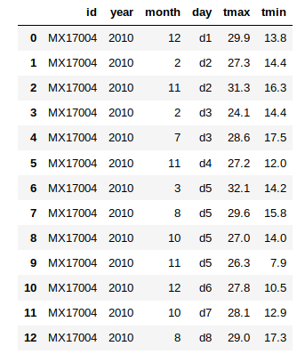

# lab-data_cleaning

A la hora de realizar el merge, lo he hecho `INNER JOIN`. El ejercicio no espicifica nada. Por tanto, he cogido los posts con la información de los usuarios que lo han escrito.

He considerado que los valores NaN en ViewCount es un fallo. Para solucionarlo he preferido crear una columna nueva como explico en el ejercicio.

Al final, en el bonus, me sale un warning, pero no detecto que dataframe está copiándose.

# Bonus: weather.csv

He representado los datos de una manera más sencilla pero sin perder nada de información, haciendo el archivo csv más liviano (ha pasado de 2.9 kb a 1.07 kb).

He decidido mantener los datos ID y año. Aunque son todos iguales, si la bbdd sigue recibiendo datos de otros años u otras estaciones, estos valores serían importantes.

Finalmente he ordenado los datos, he reseteado los índice y he exportado los datos en la carpeta `your-code` como `weather.csv`.

El código es algo sucio y estoy seguro que existen métodos de pandas que facilitan mucho el trabajo. Sin embargo, lo he conseguido de dicha manera y he decidido dejarlo así por el momento.

# Nota

Estoy intentando a través de los datos, mostrar otros nuevos, como la temperatura media, la interpolación del mes de septiembre, etc... Estos datos no los agrego a mi bbdd (el csv en este caso) ya que se pueden calcular.

No obstante, estoy algo pillado porque quiero representar los puntos en un plot y la librería `matplotlib` me está dando problemas.

